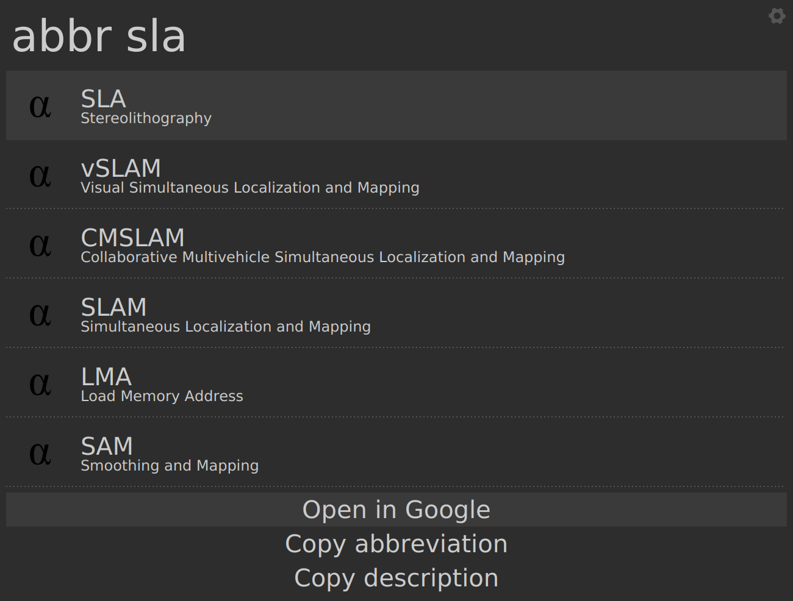

# abbr - Albert plugin

## Description

Lookup words stored in a file along with their description.

This is a, rather esoteric, plugin that looks up and saves pairs of (key, value) in a specified
file on disk.

I use it to lookup items from my personal abbreviations list. You can also add
new items to it by using the `new` keyword

## Demo

|  |  |

## Installation instructions

* Install the fuzzywuzzy python module

For more refer to the parent project: [Awesome albert plugins](https://github.com/bergercookie/awesome-albert-plugins)

## Self Promotion

If you find this tool useful, please [star it on Github](https://github.com/bergercookie/awesome-albert-plugins)

## TODO List

See [ISSUES list](https://github.com/bergercookie/awesome-albert-plugins/issues) for the things that
I'm currently either working on or interested in implementing in the near
future. In case there's something you are interesting in working on, don't
hesitate to either ask for clarifications or just do it and directly make a PR.
