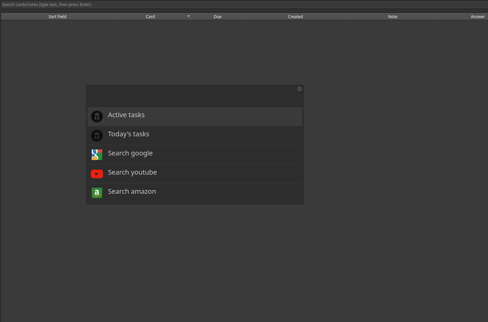
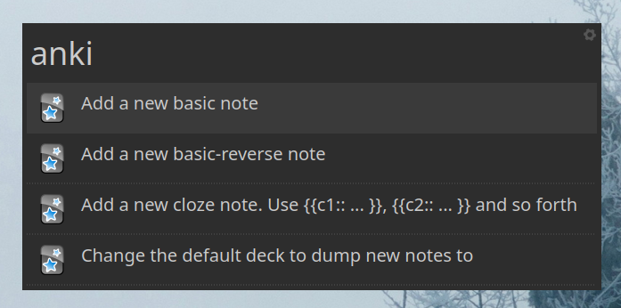

# `Anki` - Albert plugin

## Description

`Anki` card generator: Generate Basic, Basic-Reverse and Cloze cards for [Anki](https://apps.ankiweb.net/)

## Demo

### Usage demo

### User Interface

## Installation instructions

Refer to the parent project: [Awesome albert plugins](https://github.com/bergercookie/awesome-albert-plugins)

You need to have the [AnkiConnect](https://ankiweb.net/shared/info/2055492159)
plugin installed.

### Imports

You also need the following imports to work:

- `import httpx`
- `from fuzzywuzzy import process`
- `from gi.repository import GdkPixbuf, Notify`
- `from overrides import overrides`

## Self Promotion

If you find this tool useful, please [star it on Github](https://github.com/bergercookie/awesome-albert-plugins)

## TODO List

See [ISSUES list](https://github.com/bergercookie/awesome-albert-plugins/issues)
for the things that I'm currently either working on or interested in
implementing in the near future. In case there's something you are interesting
in working on, don't hesitate to either ask for clarifications or just do it and
directly make a PR.
