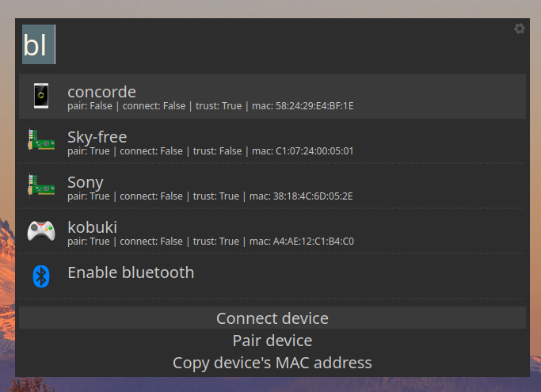
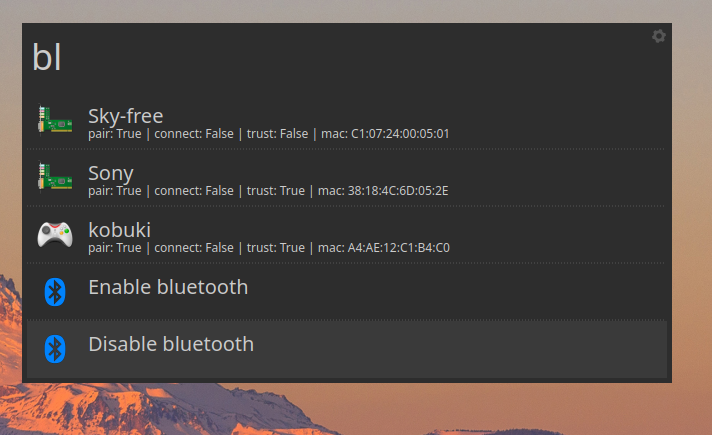

# bluetooth - Albert plugin

## Demo

https://raw.githubusercontent.com/bergercookie/awesome-albert-plugins/master/plugins/bluetooth/misc/demo.mp4

## Description

This is a small plugin that allows for:

* Connecting/disconnecting a device
* Pairing and trusting a device
* Enabling/disabling bluetooth altogether

## Installation instructions

Make sure you have `rfkill` and `bluetoothctl` installed and available in your
`$PATH`

## Self Promotion

If you find this tool useful, please [star it on
Github](https://github.com/bergercookie/awesome-albert-plugins)

## TODO List

See [ISSUES list](https://github.com/bergercookie/awesome-albert-plugins/issues)
for the things that I'm currently either working on or interested in
implementing in the near future. In case there's something you are interesting
in working on, don't hesitate to either ask for clarifications or just do it and
directly make a PR.
