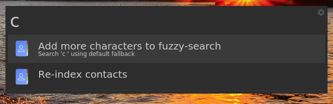
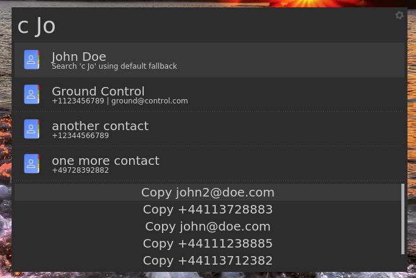

# contacts - Albert plugin

## Description

View and copy information from your contacts using
[Albert](https://albertlauncher.github.io/installing/).

To setup:

- Install [vcfxplr](https://github.com/bergercookie/vcfxplr)
- Download your contacts in the `VCF` format. Your contacts provider should have
  an export function, e.g., for Google see
  [here](https://support.google.com/contacts/answer/7199294?hl=en-GB&co=GENIE.Platform%3DDesktop)

- Enable the plugin as usual (see [parent
  project](https://github.com/bergercookie/awesome-albert-plugins) for more).
- On the first run, on `c<space>` point it to the location of the downloaded vcf
  file. On subsequent runs it should be ready to go.

You should be able to fuzzy-search through your contacts based on the contact's
full names and once you've found the contact you're looking for you should be
able to copy one of their emails, telephone numbers or full name.

## Demo

## Self Promotion

If you find this tool useful, please [star it on Github](https://github.com/bergercookie/awesome-albert-plugins)

## TODO List

See [ISSUES list](https://github.com/bergercookie/awesome-albert-plugins/issues)
for the things that I'm currently either working on or interested in
implementing in the near future. In case there's something you are interesting
in working on, don't hesitate to either ask for clarifications or just do it and
directly make a PR.
