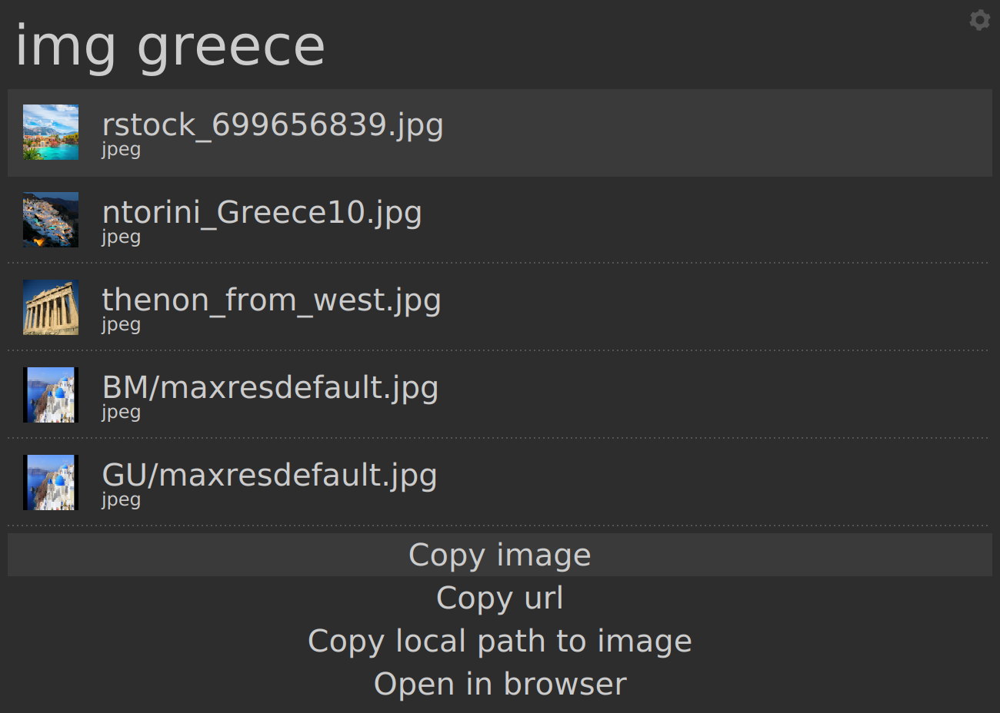
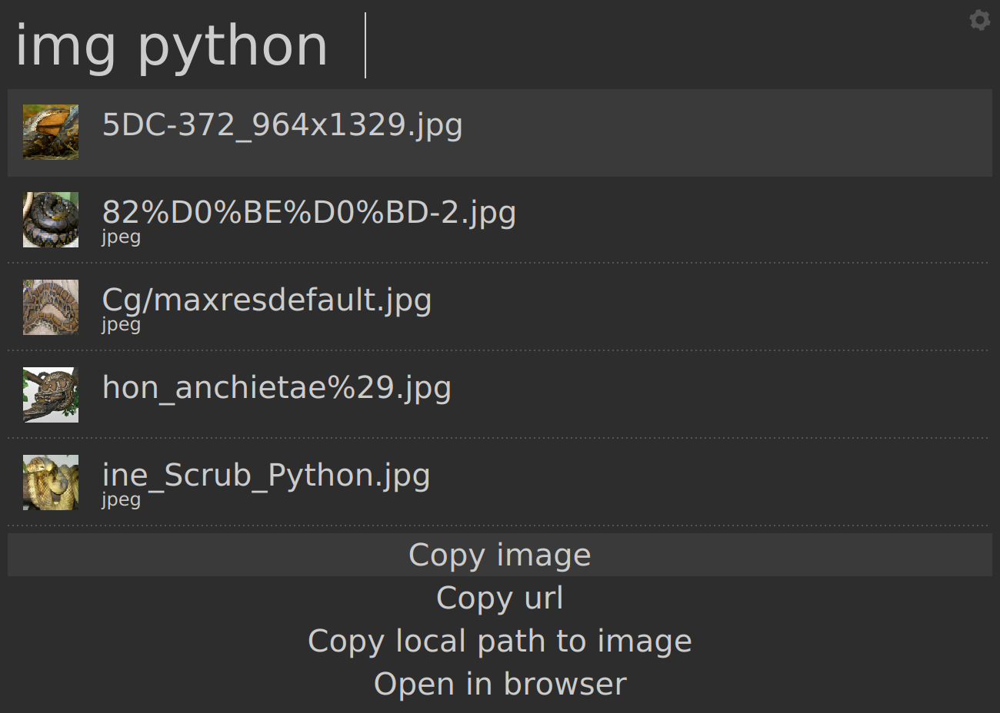
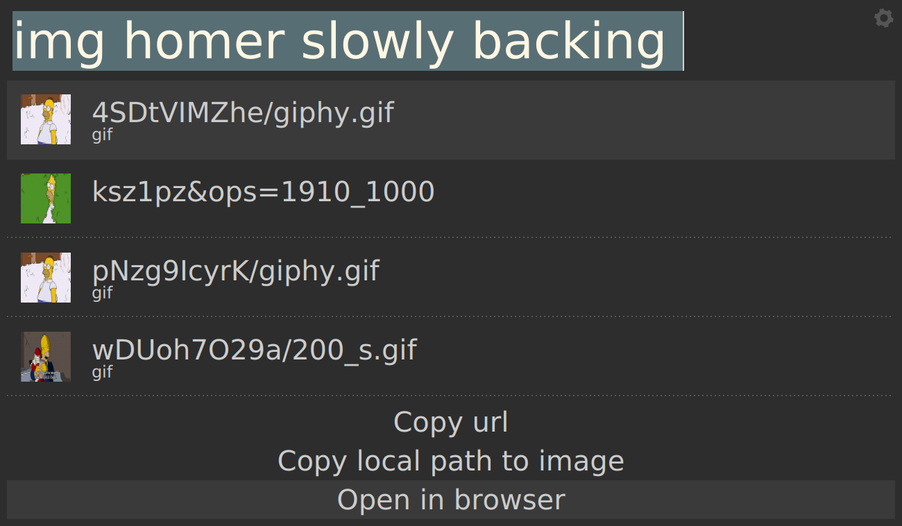

# image_search - Albert plugin

## Description

Lookup images directly from the Albert prompt. Download them locally, or copy
them directly to clipboard so that you can instantly send them to friends on
social media!

Under the hood it uses bing and beautiful soup

## Demo

|  |  |  |

## Installation instructions

On Linux, the following programs must be in your path:

* `xclip`
* `convert` (from imagemagick)

And you also have to install `beautifulsoup` via `pip3` for parsing results from Bing.

Refer to the parent project for more installation instructions if required: [Awesome albert plugins](https://github.com/bergercookie/awesome-albert-plugins)

## Self Promotion

If you find this tool useful, please [star it on Github](https://github.com/bergercookie/awesome-albert-plugins)

## TODO List

See [ISSUES list](https://github.com/bergercookie/awesome-albert-plugins/issues) for the things that
I'm currently either working on or interested in implementing in the near
future. In case there's something you are interesting in working on, don't
hesitate to either ask for clarifications or just do it and directly make a PR.
