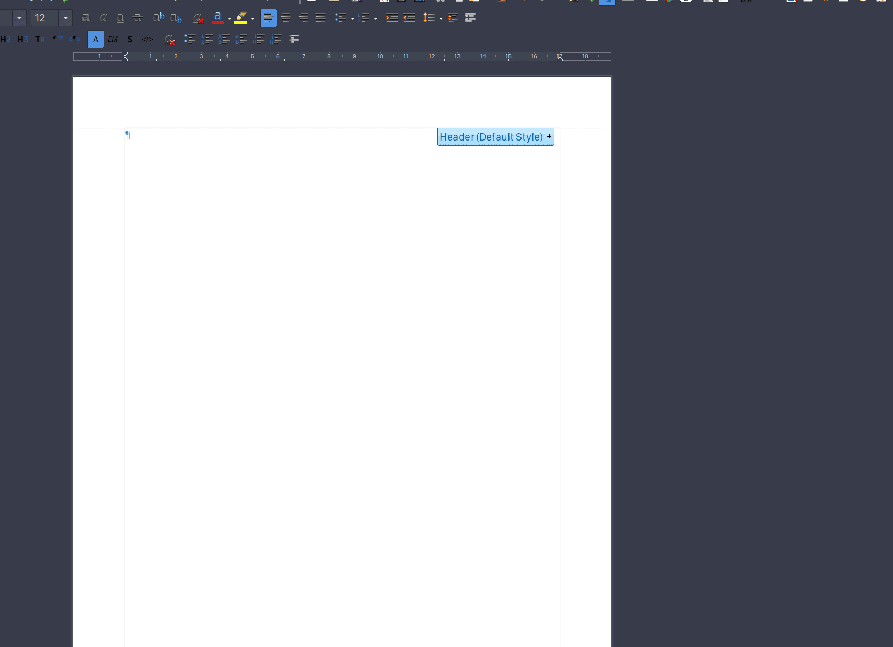

# meme-generator - Albert plugin

## Description

Generate memes from a variety of image selection and add your custom text.
Then, copy it to your clipboard, or save it to disk.

Optionally you can add effects to the meme, e.g., shaking.

The meme generation runs offline, there's no need to be connected to the internet.

## Demo

## Installation instructions

* Install [meme](https://github.com/nomad-software/meme) directly from github.
  You'll need a relatively recent version of `go` for this. You could use
  [gvm](https://github.com/moovweb/gvm) if that's not supported by your package
  manager.
* Install [xclip](https://linux.die.net/man/1/xclip)

Refer to the parent project for more: [Awesome albert
plugins](https://github.com/bergercookie/awesome-albert-plugins)

## Self Promotion

If you find this tool useful, please [star it on
Github](https://github.com/bergercookie/awesome-albert-plugins)

## TODO List

See [ISSUES list](https://github.com/bergercookie/awesome-albert-plugins/issues)
for the things that I'm currently either working on or interested in
implementing in the near future. In case there's something you are interesting
in working on, don't hesitate to either ask for clarifications or just do it and
directly make a PR.
