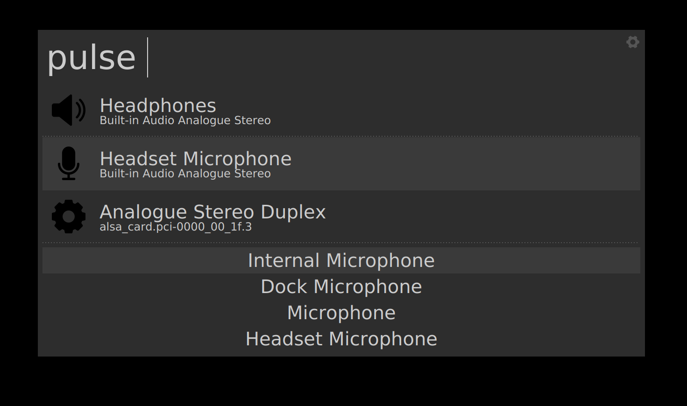
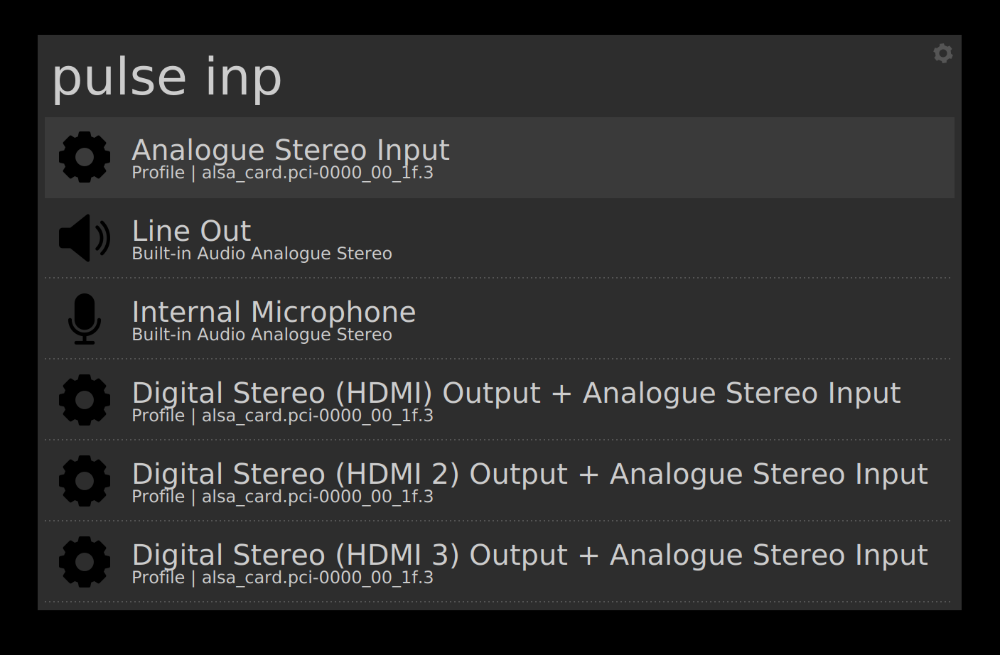

# pulse_control - Albert plugin

## Description

Allows to interact with PulseAudio and do the following:

* Set Input/Output audio device
* Set an Input/Output port
* Set an audio profile

By default, when the plugin is triggered it shows you the active port for each
one of your sources and sinks (i.e., input and output devices respectively) as
well as the active profile for each one of your sound cards.



You can also search for a specific sink/source port or a specific card profile
by adding more characters to your search after the trigger word. Upon selection
of the item, the corresponding source/sink/profile is activated.



## Prerequisites

Install pulseaudio and [pulsectl, its python
wrapper](https://pypi.org/project/pulsectl/). Also install the ``fuzzywuzzy``
python module.
```
pip3 install --user --upgrade pulsectl
```

## Installation instructions

Refer to the parent project: [Awesome albert plugins](https://github.com/bergercookie/awesome-albert-plugins)

## Self Promotion

If you find this tool useful, please [star it on Github](https://github.com/bergercookie/awesome-albert-plugins)

## TODO List

See [ISSUES list](https://github.com/bergercookie/awesome-albert-plugins/issues)
for the things that I'm currently either working on or interested in
implementing in the near future. In case there's something you are interesting
in working on, don't hesitate to either ask for clarifications or just do it and
directly make a PR.
