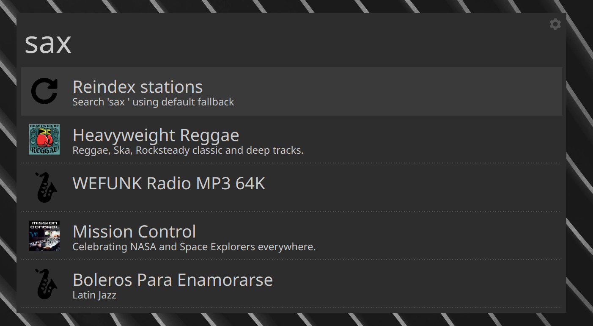
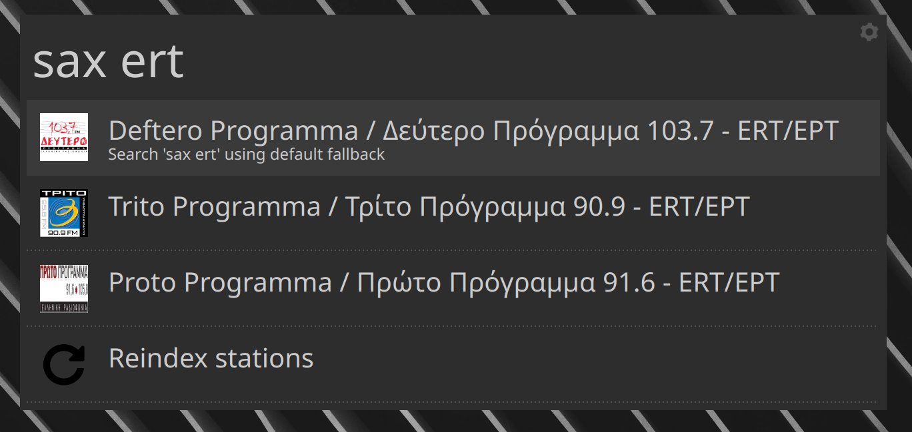
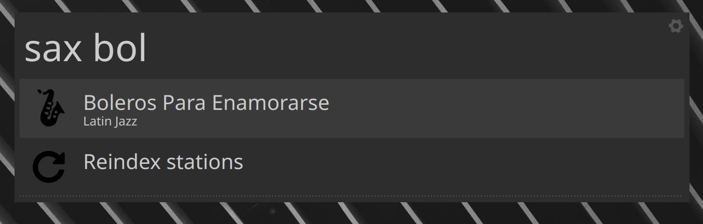
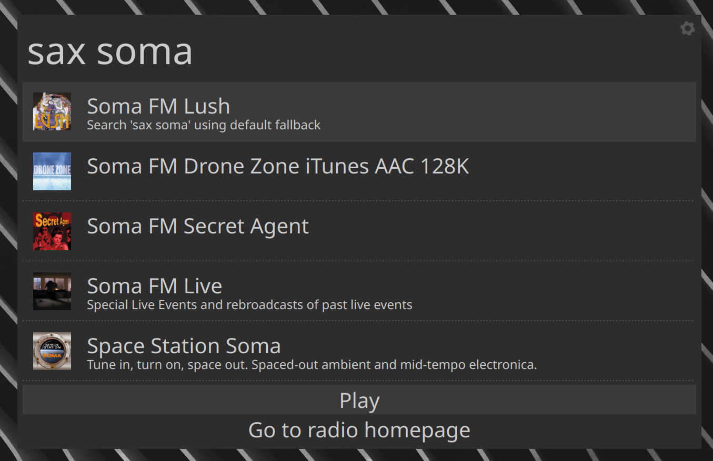

# saxophone - Albert plugin

## Demo

## Description

Current plugin allows you to play internet radio streams without any external
windows or GUIs, directly from Albert. The streams are specified in
`config/saxophone.json` file and using that it's trivial to add more streams.

If the stream contains metadata, they will be displayed via a system
notification on metadata change (e.g., when the song changes).

### Dependencies

I use `mpv` and the [python-mpv c-types
bindings](https://github.com/jaseg/python-mpv) to play the radio stream. For
this to work you have to install `libmpv.so` under your `LD_LIBRARY_PATH` and
make sure that you can `import mpv` from an interactive python interpreter. One
alternative is to install `mpv` via the [mpv-build helper
scripts](https://github.com/mpv-player/mpv-build) with the
`--enable-libmpv-shared` enabled.

Alternatively if you don't want to go through this, you could check out a
previous commit of this repo, e.g., `cf69a7a` where instead of `mpv` python
bindings, I'm using the `cvlc` executable to play the radio streams.

## Demo

## Installation instructions

Refer to the parent project: [Awesome albert plugins](https://github.com/bergercookie/awesome-albert-plugins)

## Self Promotion

If you find this tool useful, please [star it on Github](https://github.com/bergercookie/awesome-albert-plugins)

## TODO List

See [ISSUES list](https://github.com/bergercookie/awesome-albert-plugins/issues) for the things that
I'm currently either working on or interested in implementing in the near
future. In case there's something you are interesting in working on, don't
hesitate to either ask for clarifications or just do it and directly make a PR.
