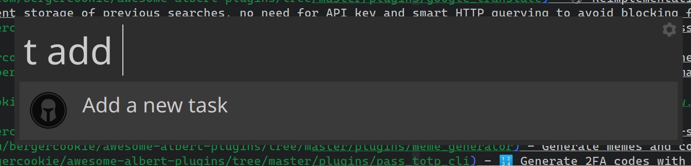
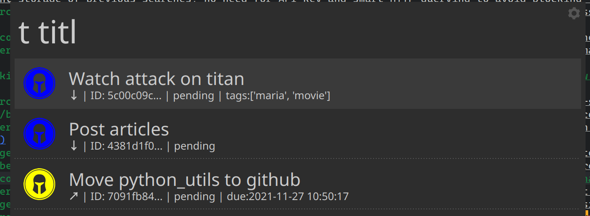

# Taskwarrior - Albert plugin

Interact with [Taskwarrior](https://taskwarrior.org/)

## Demo

## Motivation

## Manual installation instructions

Requirements:

- Albert - [Installation instructions](https://albertlauncher.github.io/docs/installing/)
  - Albert Python Interface: `v0.4`
- Python version >= 3.5
- Install [taskw_gcal_sync](https://github.com/bergercookie/taskw_gcal_sync)
- Install `overrides` python module

## Self Promotion

If you find this tool useful, please [star it on
Github](https://github.com/bergercookie/taskwarrior-albert-plugin)

## TODO List

See [ISSUES list](https://github.com/bergercookie/taskwarrior-albert-plugin/issues) for the things
that I'm currently either working on or interested in implementing in the near
future. In case there's something you are interesting in working on, don't
hesitate to either ask for clarifications or just do it and directly make a PR.
