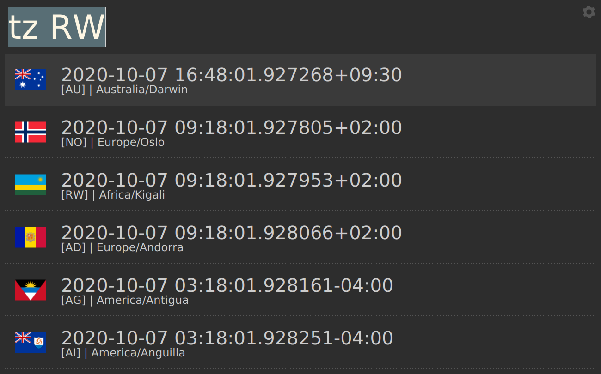
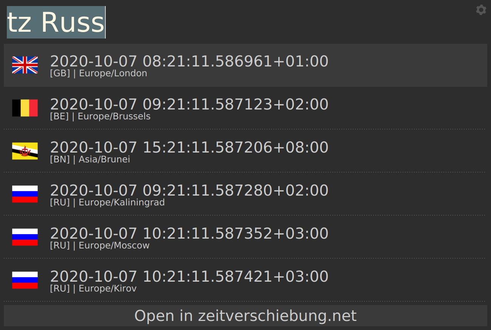

# timezones - Albert plugin

## Prerequisites

Make sure you have the following python packages installed:

* `pytz`
* `requests`
* `tzlocal`
* `fuzzywuzzy`
* `pycountry`

## Description

Lookup timezones based on either the city or the country name. The plugin will
autocomplete all the appropriate city and country names based on fuzzy search

On top it will always show you your local timezone so that you can compare.

## Demo

|  |  |

## Installation instructions

Refer to the parent project: [Awesome albert plugins](https://github.com/bergercookie/awesome-albert-plugins)

## Self Promotion

If you find this tool useful, please [star it on Github](https://github.com/bergercookie/awesome-albert-plugins)

## TODO List

See [ISSUES list](https://github.com/bergercookie/awesome-albert-plugins/issues) for the things that
I'm currently either working on or interested in implementing in the near
future. In case there's something you are interesting in working on, don't
hesitate to either ask for clarifications or just do it and directly make a PR.
