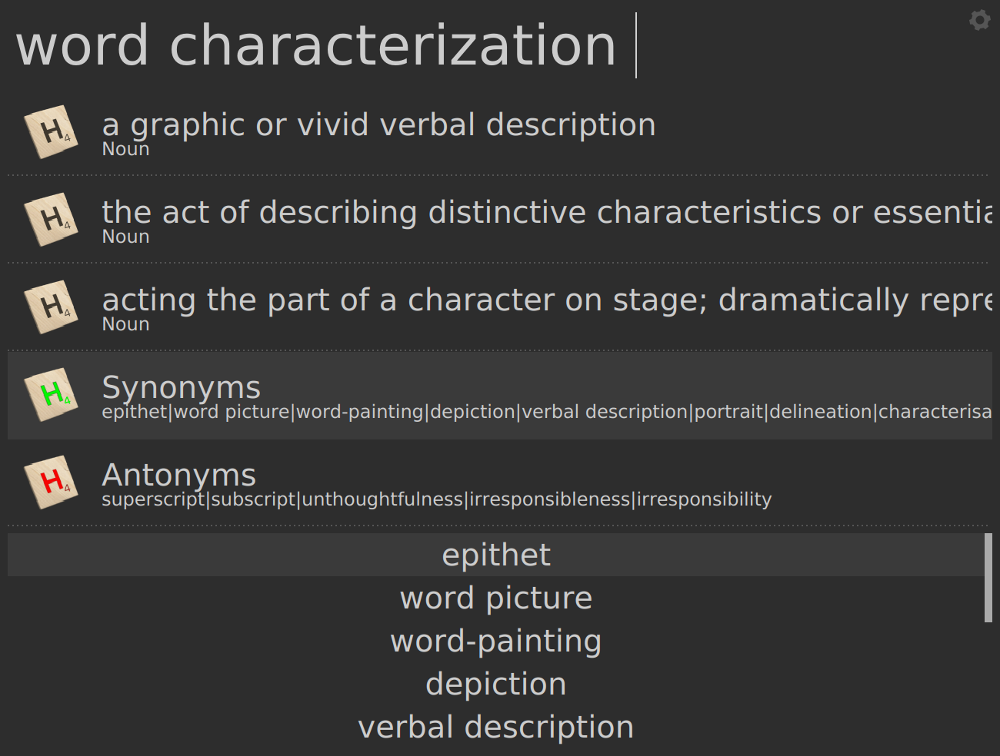

# words - Albert plugin

## Description

Get definitions, synonyms and antonyms for the given word - uses
<https://synonyms.com> under the hood.

## Demo

|  |  |

## Installation instructions

Makes use of [pydictionary](https://github.com/geekpradd/PyDictionary):

  `pip3 install --user --upgrade pydictionary`

Refer to the parent project: [Awesome albert plugins](https://github.com/bergercookie/awesome-albert-plugins)

## Self Promotion

If you find this tool useful, please [star it on Github](https://github.com/bergercookie/awesome-albert-plugins)

## TODO List

See [ISSUES list](https://github.com/bergercookie/awesome-albert-plugins/issues) for the things that
I'm currently either working on or interested in implementing in the near
future. In case there's something you are interesting in working on, don't
hesitate to either ask for clarifications or just do it and directly make a PR.
